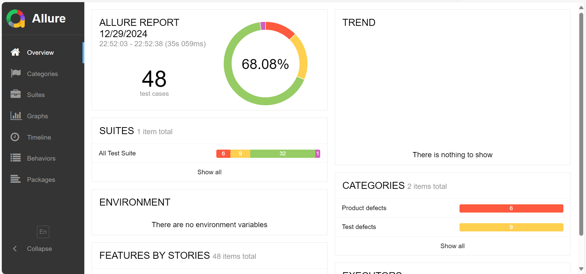

# Rest Assured Learning

### Rest Assured Basics

Project Url - https://reqres.in/

* Basics Of API Testing
* Mvn Repository links-

     RestAssured - https://mvnrepository.com/artifact/io...
     
     TestNG - https://mvnrepository.com/artifact/or...
     
     Json-Simple - https://mvnrepository.com/artifact/co...

     Jackson-DataBind - https://mvnrepository.com/artifact/com.fasterxml.jackson.core/jackson-databind

* Intro Of Rest Assured | System Setup
* How Rest Assured Works | Create HTTP Requests using BDD Style
* Validate HTTP Response Status Using BDD and Non BDD Style
* Validate HTTP Response Headers
* Validate JSON Response Body
* How To Work With Query Parameters
* Authorization | Basic Authentication & Digest Authentication
* Authorization | Bearer Token Authentication
* Authorization | API Key Authentication
* Authorization | OAuth 2.0
* Deserialize the JSON Response
* How To Retrieve/Query Request Specification
* Send XML Data As Payload In Request | Validate XML response
* What is JSON | Create JSON Object Using Java Map
* Create JSON Array Using JSON Object and List
* How To Create A JSON Object Using Jackson API

### Rest Assured Advance

* How To Upload File In Rest Assured
* How To Create Your Own API & Perform CRUD Operations
* Create POJO Class of JSON data| Serialization| Deserialization
* Create POJO Class of JSON Array| Serialization| Deserialization
* Create POJO Class of Nested JSON Object
* Create POJO Class of Complex Nested JSON Object
* Ignore Empty, Null & Default Values In Payload (@JsonInclude)
* Ignore Fields from POJO Class From Serialization&Deserialization
* Ignore Unknown Properties During Deserialization Process
* Mock API Easily | Convert JSON Response To POJO Class Object
* ResponseSpecification & ResponseSpecBuilder
* JSON Schema Validation
* JSON Schema Validation Without Rest Assured

## Allure Report

